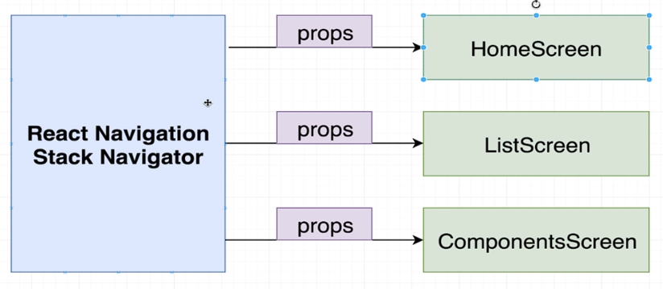
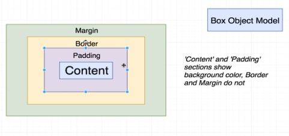
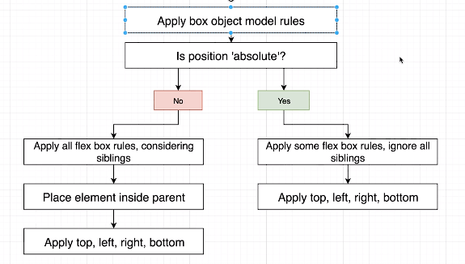

# Section 3: List Building - FlatList

- We are required to pass in a 'prop' of 'data' - the array of data that we are going to create a bunch of elements out of
- We are also required to pass in a 'renderItem' prop - a function that will turn each individual item into an element

## Key Element

- If we don't add a 'key' prop, React will re-render the entire list every time there is a change
- If we add a 'key' prop, React will only re-render the elements that have changed
- Use the 'keyExtractor' prop to tell React what property to use as the key for each item

```js
import React from "react";
import { Text, View, FlatList, StyleSheet } from "react-native";

const ListScreen = () => {
	const friends = [
		{ name: "John Doe", age: 20 },
		{ name: "Jane Doe", age: 21 },
		{ name: "John Smith", age: 22 },
		{ name: "Jane Smith", age: 23 },
		{ name: "José Diogo", age: 26 },
		{ name: "Diana Meireles", age: 25 },
	];

	return (
		<FlatList
			// Note: 'horizontal' and 'showsHorizontalScrollIndicator' are optional props that you can use if needed
			// horizontal // same as horizontal={true}
			// showsHorizontalScrollIndicator={false} // hide the horizontal scroll bar

			// hides the vertical scroll bar
			showsVerticalScrollIndicator={false}
			// Apply custom styles to the FlatList component
			style={styles.listStyle}
			// keyExtractor is a function that returns a string that will be used as the key for each item in the list
			keyExtractor={(friend) => friend.name}
			// Data to be rendered in the FlatList
			data={friends}
			// Render each item in the FlatList
			renderItem={({ item }) => {
				// Destructure the 'item' object directly to access its properties directly
				const { name, age } = item;
				return (
					// Note: We use JSX comments here for better readability within the JSX code
					<>
						{/* Each friend's name and age */}
						<Text style={styles.textStyle}>
							{name} - Age {age}
						</Text>
						{/* Add any other elements you want to render for each item */}
						{/* For example, you can add a separator between items */}
						<View style={styles.separator} />
					</>
				);
			}}
		/>
	);
};

const styles = StyleSheet.create({
	listStyle: {
		// Add any custom styles for the FlatList component here
	},
	textStyle: {
		fontSize: 18,
		// Add any custom styles for the text here
	},
	separator: {
		height: 1,
		backgroundColor: "gray",
		// Add any custom styles for the separator here
	},
});

export default ListScreen;
```

# Section 4: Navigating Users Between Screens

## Buttons with React Native

### Button

Very simple component for showing a button and detecting a press

### TouchableOpacity

Highly customizable component that can detect a press on just about any kind of element

## Navigatation

- We need:

  - import { createAppContainer } from "react-navigation";
  - import { createStackNavigator } from "react-navigation-stack";

- Inside App.js, we need to create a new component that will be the root of our navigation tree

```js
const navigator = createStackNavigator(
	{
		Home: HomeScreen,
		Components: ComponentsScreen,
		List: ListScreen,
	},
	{
		initialRouteName: "Home",
		defaultNavigationOptions: {
			title: "App",
		},
	}
);
```



```js
// destructured only navigation from props
const HomeScreen = ({ navigation }) => {
	const handleNavigation = (location) => {
		// this is how we navigate to other screens, the string passed in is the name of the screen,
		// already defined in App.js, similar to Routes in React
		navigation.navigate(location);
	};

	return (
		<View style={styles.view}>
			<Text style={styles.textStyle}>Welcome! </Text>
			<View style={styles.otherView}>
				<TouchableOpacity
					style={[styles.btnStyle, { backgroundColor: "dodgerblue" }]}
					onPress={() => handleNavigation("List")}
				>
					<Text> Navigate List </Text>
				</TouchableOpacity>
				<TouchableOpacity
					style={[styles.btnStyle, { backgroundColor: "orange" }]}
					onPress={() => handleNavigation("Components")}
				>
					<Text> Navigate Comp </Text>
				</TouchableOpacity>
			</View>
		</View>
	);
};
```

## use o withNavigation from react-navigation

Instead of passing the navigation prop down to the child component, we can use the withNavigation helper function from react-navigation

```js
const ResultList: React.FC<ResultListProps> = ({
	title,
	results,
	price,
	navigation,
}) => {
	const filteredResultsByPrice: Business[] = results.filter((result) => {
		return result.price === price;
	});

	return (
		<View style={styles.container}>
			<Text style={styles.title}>{title}</Text>
			<FlatList
				horizontal={true}
				showsHorizontalScrollIndicator={false}
				data={filteredResultsByPrice}
				keyExtractor={(item) => item.id}
				renderItem={({ item }) => (
					<TouchableOpacity
						onPress={() =>
							navigation.navigate("RestaurantScreen", { id: item.id })
						}
					>
						<RestaurantCard restaurant={item} />
					</TouchableOpacity>
				)}
			/>
		</View>
	);
};

export default withNavigation(ResultList); // don't forget to export the component wrapped with withNavigation
```

# Section 6: State Management in React Components

- props -> system to pass data from a parent component to a child component
- state -> system to track a piece of data that will change over time, if that data changes, our app will re-render

## Notes

- **Never** directly modify a state variable. React won't detect the change and won't re-render the component, use the setter function instead
- When a component is re-rendered, **all it's children are also re-rendered**
- A state variable can be passed to a child component! At that point, the state variable is now being used as props.

## Great use case for useState

- Instead of using multiple state variables, we can use a single state variable that is an object and has multiple properties

```javascript
const COLOR_INCREMENT = 15;

const SquareScreen = () => {
	const [colors, setColors] = useState({ red: 128, green: 128, blue: 255 });

	const { red, green, blue } = colors;

	const updateColor = (color, isIncrement) => {
		const step = isIncrement ? COLOR_INCREMENT : -1 * COLOR_INCREMENT;

		setColors({
			...colors,
			[color]: Math.min(Math.max(colors[color] + step, 0), 255),
		});
	};

	return (
		<View>
			<ColorCounter
				title="Red"
				onIncrease={() => updateColor("red", true)}
				onDecrease={() => updateColor("red", false)}
				colorValue={red}
			/>
			<ColorCounter
				title="Green"
				onIncrease={() => updateColor("green", true)}
				onDecrease={() => updateColor("green", false)}
				colorValue={green}
			/>
			<ColorCounter
				title="Blue"
				onIncrease={() => updateColor("blue", true)}
				onDecrease={() => updateColor("blue", false)}
				colorValue={blue}
			/>

			<View
				style={{
					width: Dimensions.get("window").width * 0.8,
					height: Dimensions.get("window").height * 0.3,
					marginHorizontal: Dimensions.get("window").width * 0.1,
					marginVertical: Dimensions.get("window").height * 0.05,
					backgroundColor: `rgb(${colors.red}, ${colors.green}, ${colors.blue})`,
					borderRadius: 20,
				}}
			/>
		</View>
	);
};
```

```js
const ColorCounter = (props) => {
	const { title, onIncrease, onDecrease, colorValue } = props;

	return (
		<View style={styles.container}>
			<View style={styles.titleContainer}>
				<Text style={{ fontSize: 45 }}>{title}</Text>
			</View>

			<TouchableOpacity
				style={[
					styles.btnStyle,
					{ backgroundColor: "orange", opacity: colorValue === 0 ? 0.5 : 1 },
				]}
				onPress={onDecrease}
				disabled={colorValue === 0}
			>
				<Text style={styles.btnText}> - </Text>
			</TouchableOpacity>

			<Text style={[styles.colorValue, { width: 60 }]}> {colorValue}</Text>

			<TouchableOpacity
				style={[
					styles.btnStyle,
					{ backgroundColor: "green", opacity: colorValue === 255 ? 0.5 : 1 },
				]}
				onPress={onIncrease}
			>
				<Text style={styles.btnText}> + </Text>
			</TouchableOpacity>
		</View>
	);
};
```

## State Management with Reducer

- Function that manages changes to an object
- Called with two objects (arguments)
  1. object that has all the state inside of it
  2. object that describes the update we want to make to the state
- 2 technicalities:
  1. Never change Argument #1 directly
  2. Always return a value to be used as Argument #1

## Community Conventions

- Use 'type' to describe the exact change operation we want to make (e.g. 'change_red' instead of 'red')
- Use 'payload' to describe the exact amount that we want to change the state by (e.g. 'amount')

### Example

```js
const reducer = (state, action) => {
	switch (action.type) {
		case "change_red":
			// don't modify state directly (e.g. state.red = state.red - 15)
			// instead: return a completely new object, with the updated state
			return {
				...state,
				red: Math.max(0, Math.min(255, state.red + action.payload)),
			};
		case "change_green":
			return {
				...state,
				green: Math.max(0, Math.min(255, state.green + action.payload)),
			};
		case "change_blue":
			return {
				...state,
				blue: Math.max(0, Math.min(255, state.blue + action.payload)),
			};
		default:
			return state;
	}
};

const SquareScreen = () => {
	// initial state === { red: 0, green: 0, blue: 0 }
	// dispatch === runMyReducer
	const [state, dispatch] = useReducer(reducer, { red: 0, green: 0, blue: 0 });

	// destructure state
	const { red, green, blue } = state;

	const windowDim = Dimensions.get("window");

	return (
		<View>
			<ColorCounter
				title="Red"
				onIncrease={() =>
					dispatch({ type: "change_red", payload: COLOR_INCREMENT })
				}
				onDecrease={() =>
					dispatch({ type: "change_red", payload: -1 * COLOR_INCREMENT })
				}
				colorValue={red}
			/>
			<ColorCounter
				title="Green"
				onIncrease={() =>
					dispatch({ type: "change_green", payload: COLOR_INCREMENT })
				}
				onDecrease={() =>
					dispatch({ type: "change_green", payload: -1 * COLOR_INCREMENT })
				}
				colorValue={green}
			/>
			<ColorCounter
				title="Blue"
				onIncrease={() =>
					dispatch({ type: "change_blue", payload: COLOR_INCREMENT })
				}
				onDecrease={() =>
					dispatch({ type: "change_blue", payload: -1 * COLOR_INCREMENT })
				}
				colorValue={blue}
			/>

			<View
				style={{
					width: windowDim.width * 0.8,
					height: windowDim.height * 0.3,
					marginHorizontal: windowDim.width * 0.1,
					marginVertical: windowDim.height * 0.05,
					backgroundColor: `rgb(${red}, ${green}, ${blue})`,
					borderRadius: 20,
				}}
			/>
		</View>
	);
};
```

# TextInput Element

- iOS auto capitalizes the first letter of the first word in a sentence
- By default, the TextInput element does not have any styling neither in iOS nor in Android

## Important Props

- autoCapitalize = "none" (iOS only) => e.g. sentences should start with a capital letter
- autoCorrect = { false } => e.g email addresses should not be auto corrected
- secureTextEntry = { true } => e.g. passwords should be hidden
- onChangeText = { (newValue) => doSomething(newValue) } => e.g. update the state variable with the new value
- onEndEditing = { () => doSomething() } => e.g. function gets called when the user presses the 'Done' button on the keyboard

```js
const TextScreen = () => {
	<TextInput
		style={styles.textInput}
		autoCapitalize="none"
		autoCorrect={false}
		value={password}
		onChangeText={(newValue) => setPassword(newValue)}
		secureTextEntry={true}
	/>;
};
```

# Section 7: How to Handle Screen Layout

## Layout Systems

- **Box Object Model (BOM):**
  - the **height / width** of an element + the space around it (**padding**, **margin**, **border**)
  - use this to affect the positioning of a single element
- **Flex Box:**
  - How some number of sibling elements get laid out **inside a parent**
  - Use this to position multiple elements with a **common parent**
- **Position:**
  - How an element is positioned relative to its parent
  - Use this to override the default behavior of **BOM** + **Flex Box**

## Box Object Model (BOM)



## Flex Box

### flexDirection

- **row** - horizontal
- **column** - vertical (**by default**)
- affects the direction of the main axis:
  - **row** => main axis is horizontal (meaning justifyContent affects the horizontal axis and alignItems affects the vertical axis)
  - **column** => main axis is vertical (meaning justifyContent affects the vertical axis and alignItems affects the horizontal axis)

### alignItems

- flex-start
- flex-end
- center
- stretch (**by default**)

### justifyContent

- flex-start (**by default**)
- flex-end
- center
- space-between (focus on the space between elements)
- space-around (focus on the space around elements)

### alignSelf

- overrides the alignItems property received from the parent for a single element

## Position

- relative (default)
- absolute (powerful when combined with top, bottom, left, right)

## Absolute Fill Object (trick)

- absoluteFillObject is a helper object that can be used to fill up the entire parent element
- set position: "absolute" and top: 0, bottom: 0, left: 0, right: 0
- or in a single line: ...StyleSheet.absoluteFillObject



# React Navigation

npm install react-navigation --legacy-peer-deps

## Dependencies

1. npx expo install react-native-gesture-handler react-native-reanimated react-native-screens react-native-safe-area-context @react-native-community/masked-view -- --legacy-peer-deps
2. npm install react-navigation-stack @react-native-community/masked-view --legacy-peer-deps

```ts
import { createAppContainer } from "react-navigation";
import { createStackNavigator } from "react-navigation-stack";

import SearchScreen from "./src/screens/SearchScreen";

const navigator = createStackNavigator(
	{
		// Routes
		Search: SearchScreen,
	},
	{
		initialRouteName: "Search",
		defaultNavigationOptions: {
			title: "Business Search",
		},
	}
);

export default createAppContainer(navigator);
```

# Section 8: Making API Requests with React Native

## Axios

- npm install axios

```ts
import axios from "axios";
import { YELP_API_KEY } from "@env";

export default axios.create({
	baseURL: "https://api.yelp.com/v3/businesses",
	headers: {
		Authorization: `Bearer ${YELP_API_KEY}`,
	},
});
```

# Section 9: Making Hooks Reusable

## useEffect Hook

- useState(() => {}) => runs the arrow function **every time** the component is rendered
- useEffect(() => {}, **[]**) => runs the arrow function only when the component is **first rendered**
- useEffect(() => {}, **[value]** ) => runs the arrow function only when the component is **first rendered** and **when the value changes**

# Section 10: Advanced State Management

## Create the Context (e.g inside src/context/BlogContext.js)

- value is the data that we want to share with all the components that are inside the BlogProvider
- {children} is a special prop that is passed to the BlogProvider component automatically by React, it represents all the components that are inside the BlogProvider, including children of children

```js
import React from "react";

const BlogContext = React.createContext();

export const BlogProvider = ({ children }) => {
	return <BlogContext.Provider value={5}>{children}</BlogContext.Provider>;
};

export default BlogContext;
```

## Wrap the App with the Context Provider (e.g inside App.js)

```js
const navigator = createStackNavigator(
	{
		Home: IndexScreen,
	},
	{
		initialRouteName: "Home",
		defaultNavigationOptions: {
			title: "Blogs",
		},
	}
);

const styles = StyleSheet.create({
	container: {},
});

const App = createAppContainer(navigator);

export default () => {
	return (
		<BlogProvider>
			<App />
		</BlogProvider>
	);
};
```

## Consume the Context (e.g inside src/screens/IndexScreen.js)

```js
const IndexScreen = () => {
	const value = useContext(BlogContext);
	console.log(value);
	return <Text style={styles.text}>Index Screen</Text>;
};
```

# Fancy way of creating a Context Provider (Similar to Redux)

## Create a reusable Context Provider (since the code is similar for all the Context Providers)

```js
import React, { useReducer, createContext } from "react";

// Export a Higher Order Function that sets up a custom context provider
export default (reducer, actions, initialState) => {
	const Context = createContext();

	const Provider = ({ children }) => {
		const [state, dispatch] = useReducer(reducer, initialState);

		// Initialize an empty object to store the bound action functions
		const boundActions = {};

		// Loop through the actions object to create "bound" versions of the actions
		for (let key in actions) {
			// Each action function in the actions object receives the dispatch function as an argument

			// A "bound" action function is created by invoking the original action function with the dispatch function
			// The bound action function is a convenience wrapper around dispatch, making it easier to trigger specific actions
			boundActions[key] = actions[key](dispatch);
		}

		return (
			<Context.Provider value={{ state, ...boundActions }}>
				{children}
			</Context.Provider>
		);
	};

	// Return an object with the custom context (Context) and the Provider component
	return { Context, Provider };
};
```

## Create a Context Provider

```js
import createDataContext from "./createDataContext";

const blogsData = [
	/* ... */
];

const blogReducer = (state, action) => {
	switch (action.type) {
		case "addBlog":
			return [
				...state,
				{
					id: state.length + 1,
					title: `Blog Post #${state.length + 1}`,
					content: `Blog Post #${state.length + 1} content`,
				},
			];
		default:
			return state;
	}
};

const addBlogPost = (dispatch) => {
	return () => {
		dispatch({ type: "addBlog" });
	};
};

export const { Context, Provider } = createDataContext(
	blogReducer, // reducer
	{ addBlogPost }, // actions
	blogsData // initial state
);
```
